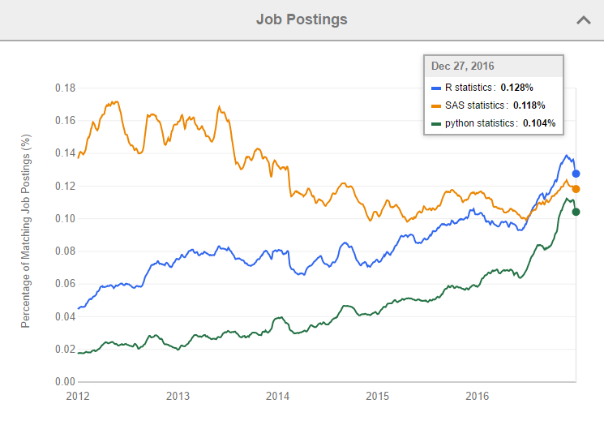
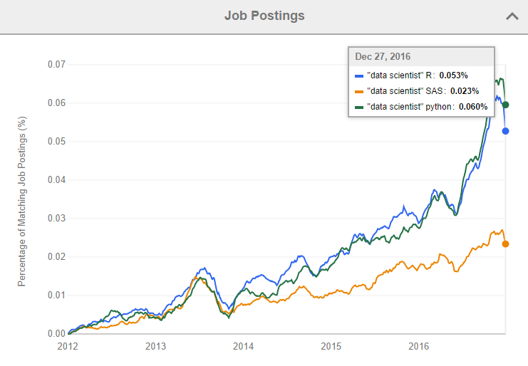
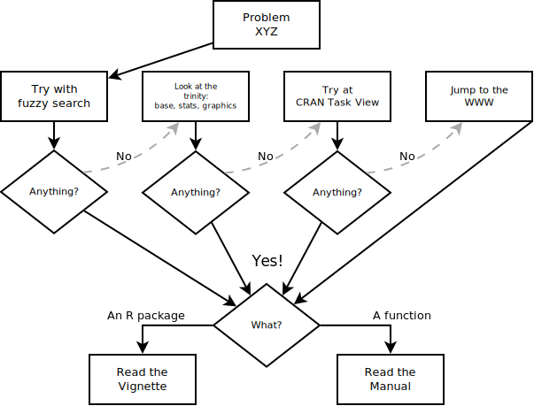

# Before we start

We will be using:

-   R (of course), and you can get it from https://cloud.r-project.org/

-   RStudio (highly recommended), an IDE for R, and you can get if from https://www.rstudio.com/products/rstudio/

-   Materials for this presentation (including the presentation itself) can be downloaded from https://github.com/USCbiostats/rbootcamp

# The R programming language

<figure>

<figcaption>From left to right: John Chambers, Robert Gentleman, and Ross Ihaka.</figcaption>
</figure>

* Free software oriented for **statistical computing** and **graphics** (although people use for everything now a days)

* R [@R] is an implementation (dialect) of the S (Statistics) programming language, which was created in 1976 by **[John Chambers](https://wikipedia.org/wiki/John_Chambers_(statistician))** while at Bell Labs. 

* R itself was created by **[Ross Ihaka](https://wikipedia.org/wiki/Ross_Ihaka)** and **[Robert Gentleman](https://wikipedia.org/wiki/Robert_Gentleman_(statistician))** at the University of Auckland, New Zealand. First release in 1995 [@Ihaka1996].

* In 1995, thanks to [**Martin Mächler**](http://stat.ethz.ch/~maechler/){target="_blank"} R was made free under the GNU General Public License.

* Is maintain mostly by the [**R Core Team**](https://www.r-project.org/contributors.html){target="_blank"} (about 20 members worldwide), with the support of [**The R Foundation**](https://www.r-project.org/foundation/){target="_blank"}

# The R Community

Has a thriving community of users and developers worldwide:

*   About **13,000 packages**(libraries) on [CRAN](https://cran.r-project.org){target="_blank"} (The Comprehensive R Archive Network)
    
    > "[A] network of ftp and web servers around the world that store identical, up-to-date, versions of code and documentation for R"

*   Nearly **1.500** packages on [Bioconductor](https://www.bioconductor.org){target="_blank"}
    
    > [A]n open source, open development software project to provide tools for the analysis and comprehension of high-throughput genomic data. It is based primarily on the R programming language. -- https://www.bioconductor.org/about/

-   More than **1,000** attendees in useR!2017 conference

# Everybody Loves R

Source: [What are the Most Disliked Programming Languages?](https://stackoverflow.blog/2017/10/31/disliked-programming-languages/){target="_blank"} by [David Robinson](http://varianceexplained.org/about/){target="_blank"}

# R = $

As pointed out by [David Smith](https://ropensci.org/blog/2017/10/13/rprofile-david-smith/){target="_blank"} on ["Job trends for R and Python"](http://blog.revolutionanalytics.com/2017/02/job-trends-for-r-and-python.html){target="_blank"}

Original plots from [indeed.com's Job trends](https://www.indeed.com/jobtrends/q-R-statistics-q-SAS-statistics-q-python-statistics.html){target="_blank"}

# The first lesson: Getting help

In R, if you want to:

*   Know about the **`sqrt`** function? **`?sqrt`**, or **`help("sqrt")`**

*   Know about the **`makeCluster`** function in the R package **`parallel`**? **`?parallel::makeCluster`**, or **`help("makeCluster", package="parallel")`**

*   Know about the Regular Expressions? **`??"Regular Expressions"`**, or **`help.search("Regular Expressions")`**

*   See a full list of the functions and help files available in the package **`boot`**: **`help(package="boot")`**.

*   Look at more in deph information about the Matrix package? **`vignette(package="Matrix")`**

# The first lesson: Getting help (How to read it?)

Take a look at Kieran Healy's [Data Visualization: A practical introduction](http://socviz.co/appendix.html#appendix).

# Online 

*   Checkout the [CRAN Task Views](https://cran.r-project.org/web/views/)

*   Take a look at the **rstats** tag on [StackOverflow.com](https://stackoverflow.com/questions/tagged/r)

*   Visit the [r-bloggers.com](https://r-bloggers.com) website

*   Read one of the dozens of online free books about R created with the [R package bookdown](https://cran.r-project.org/package=bookdown) at
    [bookdown.org](https://bookdown.org/)
    
*   Ask a question on twitter using the [\#rstats](https://twitter.com/hashtag/rstats) hashtag.

# A mental model

<figure>

<figcaption>My own personal way of looking for R-based solutions to my problems (in science... of course)</figcaption>
</figure>

# Questions

1.  Using the `stats` package, How can you estimate a **generalized linear model** in R?

2.  What is the command to **transpose** a matrix in R? What about the command for inverting a matrix?

3.  Looking at CRAN task Views, what R packages are available for **Structural Equation Modeling**? What about **GWAS**?

4.  Create a list of R packages that provide functions to read/write shapefiles (spatial data).

5.  What does return the function for fitting nonlinear least squares in the `stats` package?

6.  What is the most voted question about R on Stackoverflow (it is an important one)?

# Books that I recommend

*   The art of R programming https://nostarch.com/artofr.htm [@matloff2011art]

*   Advanced R http://adv-r.had.co.nz/ [@wickham2015advanced]

*   R Programming for Data Science https://bookdown.org/rdpeng/rprogdatascience/ [@peng2012r]

*   R for Data Science http://r4ds.had.co.nz/ [@wickham2016r]

*   Scientific Programming and Simulation using R [@jones2009introduction]

# References
