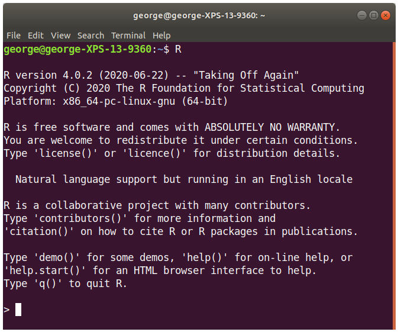
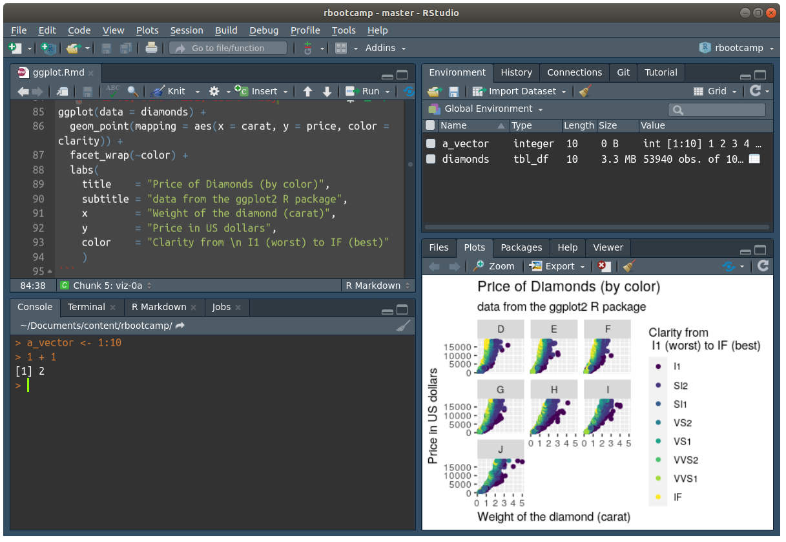

# Overview

1. What is R and Rstudio?

2. Getting help with R.

3. A live example with ggplot2.


# Part 1: What is R?

## First questions

### What is R?


> R is a language and environment for statistical computing and graphics.
--- https://r-project.org

### What is RStudio?


> RStudio is an integrated development environment (IDE) for R.
--- https://rstudio.org/products/rstudio

---

<figure>

<figcaption>A nice way to see R vs RStudio by [ModernDive](https://moderndive.com/) (original tweet [here](https://twitter.com/ModernDive/status/1171456164938141697))</figcaption>
</figure>

---

## R in the terminal



---

## R + RStudio



##

Let's see a live view of RStudio!...

# Part 2: Hands on with ggplot2

All the code for this section can be downloaded [here](slides.R). The entire presentation (which contains the code) was generated using RMarkdown and can be downloaded from [here](slides.Rmd).

(you will learn more about RMarkdown in day 3!)

---

## Set-up: Loading R packages and Data

```{r set-up}
library(ggplot2)
data("diamonds")
```

- The line `library(ggplot2)` loaded the package `ggplot2`.

- The line `data("diamonds")` loaded the dataset `diamonds` from the ggplot package.

To get help regarding a function, we can use the `help("<FUNCTION NAME>")` command in R, for example, if we wanted to learn more about `library()`, we could just type

```r
help("library")
```

Or also equally valid

```r
?"library"
```

(let's checkout how does the help file looks like!)

---

## Questions A:

1. What other arguments does the function `data()` accepts?

2. What does the function `str` does?

---

## Looking at the Data

How does data look like in R? There are many ways to represent data in R. One of the most flexible (popular?) ways of doing is through `data frames` (in the case of ["base R"](https://cran.r-project.org), the core component of R) and `tibbles` (in the case of the [tidyverse](https://tidyverse.org)). Tibbles/data frames share the same structure:

- Data entries (individuals/genes/countries/etc.) are organized by row.
- Features are organized by columns.

---

For example, here is how R prints a `tibble` and a `data.frame`:

```{r head-of-diamonds-tibble, echo=FALSE}
head(diamonds)
```

And a data frame version of the same data:

```{r head-of-diamonds-dataframe, echo=FALSE}
head(as.data.frame(diamonds))
```

---

R has functions to query/ask how many rows and columns these objects have, we can use the `nrow` and `ncol` functions as follows:

```{r quick-data-look, results='hold'}
# How many rows and columns?
nrow(diamonds)
ncol(diamonds)
```

Now let's get our hands dirty and do some visualization!

---

## A Walk Through Example with ggplot2

The `ggplot2` R package is for sure the most popular way to build plots in R. Here we will be looking at a couple of examples using the `diamond` dataset that we just loaded.


```{r viz-0a, echo=FALSE, cache=TRUE}
ggplot(data = diamonds) +
  geom_point(mapping = aes(x = carat, y = price, color = color)) +
  facet_wrap(~clarity) + 
  labs(
    title    = "Price of Diamonds (by clarity)",
    subtitle = "data from the ggplot2 R package",
    x        = "Weight of the diamond (carat)",
    y        = "Price in US dollars",
    color    = "Color from \n J (worst) to D (best)"
    )
```

---

The overall structure of ggplot is as follows:

```
ggplot(data = <DATA>) +
  <GEOM_FUNCTION>(mapping = aes(<MAPPINGS>))
```

- The `ggplot()` function sets up the data that we will be using
- The `<GEOM_FUNCTION>()` actually tells what type of plot are we building (histogram, scatterplot, barplot, etc.)
- The `aes(<MAPPINGS>)` indicates how **features (columns)** of the data are to be included in the plot.
- The `+` sign at the end of the line binds things together (we can add many layers/components to a single plot!)

---

Let's see what happens if we run the following code?

```{r viz-0b}
ggplot(data = diamonds)
```

Nothing! Because we haven't told ggplot what we want to visualize. The function only knows that we would like to work with the `diamonds` dataset, but it has no idea of what to plot!

---

Let's try again using the following code

```{r viz-0c, eval = FALSE}
ggplot(data = diamonds) +
  geom_point()
```

```
Error: geom_point requires the following missing aesthetics: x and y
Run `rlang::last_error()` to see where the error occurred.
```

Ups! We got an error, and the error says `"geom_point requires the following missing aesthetics: x and y"`, which means that we still need to give ggplot a bit more of information about what we would like to visualize. Saying that we want a scatter plot without indicating what are the variables is meaningless.

---

So let's try again one more time and see what we get!

```{r viz-1, cache=TRUE}
ggplot(data = diamonds) +
  geom_point(mapping = aes(x = carat, y = price))
```


---

How does the color affect the price?

```{r viz-2, cache=TRUE}
ggplot(data = diamonds) +
  geom_point(mapping = aes(x = carat, y = price, color = color))
```

---

Now, how about clarity of the diamond?

```{r viz-3, cache=TRUE}
ggplot(data = diamonds) +
  geom_point(mapping = aes(x = carat, y = price, color = color)) +
  facet_wrap(~clarity)
```

---

Finally, let's add some titles to make it look nicer

```{r viz-4, cache=TRUE}
ggplot(data = diamonds) +
  geom_point(mapping = aes(x = carat, y = price, color = color)) +
  facet_wrap(~clarity) + 
  labs(
    title    = "Price of Diamonds (by clarity)",
    subtitle = "data from the ggplot2 R package",
    x        = "Weight of the diamond (carat)",
    y        = "Price in US dollars",
    color    = "Color from \n J (worst) to D (best)"
    )
```

---

## What else can we do?

- As one of the most popular R packages, besides of the types of plots included in `ggplot2`, there are dozends of other R packages that extend ggplot2! https://exts.ggplot2.tidyverse.org/gallery/

---

### ggwordcloud


Get it from CRAN here: https://cran.r-project.org/package=ggwordcloud


---

### gganimate


Get it from CRAN here: https://cran.r-project.org/package=gganimate

---

### ggridges


Get it from CRAN here: https://cran.r-project.org/package=ggridges

---

## Questions B

1. Reproduce the last plot but this time put `carat` in the `y` axis and `price` in the `x` axis.

2. Using the `"mpg"` dataset (which can be loaded using `data(mpg)`), draw a similar plot using the following mappings
`aes(x = displ, y = hwy, color = drv)`. Fill in the missing pieces to get the plot:

```
data(< DATA >)
ggplot(data = < DATA >) + 
  geom_point(mapping = < MAPPINGS >) +
  labs(
    title    = "Fuel economy data",
    subtitle = "(1999 - 2008)",
    x        = "Engine displacement (liters)",
    y        = "Highway MPG",
    color    = "Drive train"
  )
```

---

## Question B 1: Solution 

```{r viz-4-swapped, cache=TRUE}
ggplot(data = diamonds) +
  geom_point(mapping = aes(x = price, y = carat, color = color)) +
  facet_wrap(~clarity) + 
  labs(
    title    = "Price of Diamonds (by clarity)",
    subtitle = "data from the ggplot2 R package",
    y        = "Weight of the diamond (carat)",
    x        = "Price in US dollars",
    color    = "Color from \n J (worst) to D (best)"
    )
```

---

## Question B 2: Solution 

```{r mpg-sol, eval=TRUE, echo=TRUE}
data(mpg)
ggplot(data = mpg) + 
  geom_point(mapping = aes(x = displ, y = hwy, color = drv)) +
  labs(
    title    = "Fuel economy data",
    subtitle = "(1999 - 2008)",
    x        = "Engine displacement (liters)",
    y        = "Highway MPG",
    color    = "Drive train"
  )
```

---

## Bonus: An example using Boxplots

```{r example-w-boxplot, cache = TRUE}
ggplot(data = diamonds) +
  geom_boxplot(mapping = aes(x = clarity, y = price, fill = clarity)) 
```

---

## References

- "R for data science" (free online book) https://r4ds.had.co.nz/

- The R graph gallery https://www.r-graph-gallery.com/

- The `bookdown` website (tons of free books about R) https://bookdown.org/

- "R Markdown: The Definitive Guide" (free online book) https://bookdown.org/yihui/rmarkdown/

- "RStudio Premiers" (online interactive tutorials with R) https://rstudio.cloud/learn/primers

- RStudio Webinars https://rstudio.com/resources/webinars/