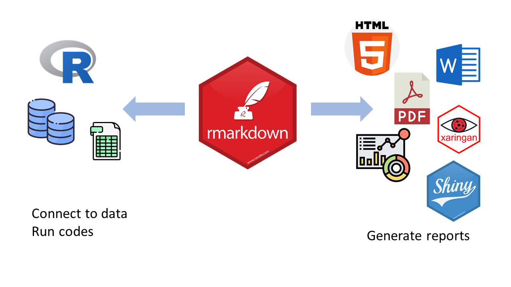

```{r xaringan-tile-view, echo = F}
xaringanExtra::use_tile_view()
```

```{r xaringan-webcam, include = F}
xaringanExtra::use_webcam(width = 300, height = 225)
```

```{r xaringan-panelset, echo = F}
xaringanExtra::use_panelset()
```

class: center, middle, inverse  

# Creating reproducible reports using R Markdown
### R Bootcamp for Scientific Computing 2022: Lecture 2   
<b>
<b>
#### 2022/08/17  

```{r, echo=FALSE, out.width="70%", out.height="70%"}
 
```


---
background-image: url(https://github.com/rstudio/hex-stickers/blob/master/PNG/rmarkdown.png?raw=true)
background-position: 95% 10%  
background-size: 20%   

# Overview   
### 1. What is RMarkdown/Markdown?         

### 2. "Knit" Scripts to Reports       

### 3. My Favorite Packages Using RMarkdown     

---
# What is RMarkdown/Markdown?         

.center[
```{r, echo=FALSE, out.width="100%", out.height="100%"}
 

```
]  
 

---
# A .rmd file          

.right-column[
```{r, echo=FALSE, out.width="80%", out.height="80%"}
knitr::include_graphics("rmdfile.png") 

```
]  

--

.left-column[  
<b>  
<b>  
 **YAML**   
 "YAML Ain't Markup Language"
<b>    
<b>   
<b>  
 **TEXT**   
 "Markdown language"
  
 **Code Chunk**   
]   
---
class: inverse 
# Activity #1 (create a .rmd file)    

--

.center[
```{r, echo=FALSE, out.width="90%", out.height="90%"}
knitr::include_graphics("notebookinterface.png") 

```
]


---
background-image: url(https://github.com/rstudio/hex-stickers/blob/master/PNG/knitr.png?raw=true)
background-position: 95% 10%  
background-size: 10% 
# Render output  

.pull-left[
```{r, eval = F}  
library(rmarkdown)
render("***.Rmd")  
```
]

.pull-right[
use the “**Knit**” button in the RStudio IDE 
]

--

## How it works?   

.center[
```{r, echo=FALSE, out.width="90%", out.height="90%"}
knitr::include_graphics("rmarkdownflow.png") 
```
]

---
class: inverse 
# Activity #2 (render a .rmd file)    

--

.center[
```{r, echo=FALSE, out.width="90%", out.height="90%"}
knitr::include_graphics("renderfile.png") 

```
]

---
.right-column[
```{r, echo=FALSE, out.width="80%", out.height="80%"}
knitr::include_graphics("rmdfile.png") 
```
]  

.left-column[  
<b>  
<b>  
 **YAML**   
 "YAML Ain't Markup Language"
<b>    
<b>   
<b>  
 **TEXT**   
 "Markdown language"
  
 **Code Chunk**   
]   

---
background-image: url(markdown.png)
background-position: 98% 5%  
background-size: 5% 
.panelset[
.panel[
.panel-name[Header]   

.pull-left[
## Markdown text   
```no-highlight
# H1
## H2
### H3
#### H4
##### H5
###### H6

```
]

.pull-right[
## Rendered text   
# H1
## H2
### H3
#### H4
##### H5
###### H6

]

]

.panel[
.panel-name[Emphasis]   
.pull-left[
## Markdown text   
```no-highlight
Italics, with *asterisks* or _underscores_.

Bold, with **asterisks** or __underscores__.

Combined emphasis with **asterisks and _underscores_**.

Strikethrough uses two tildes. ~~Scratch this.~~
```
]

.pull-right[
## Rendered text   
Italics, with *asterisks* or _underscores_.

Bold, with **asterisks** or __underscores__.

Combined emphasis with **asterisks and _underscores_**.

Strikethrough uses two tildes. ~~Scratch this.~~

]

]

.panel[
.panel-name[Lists]   
.pull-left[
## Markdown text   
```no-highlight
1. First ordered list item
2. Another item
‹…* Unordered sub-list. 
1. Actual numbers don't matter, just that it's a number
‹…1. Ordered sub-list
4. And another item.

‹…An indented paragraphs within list items.

Asterisks Unordered list can use asterisks
- Or minuses
+ Or pluses
```
]

.pull-right[
## Rendered text   
1. First ordered list item
2. Another item
  * Unordered sub-list. 
1. Actual numbers don't matter, just that it's a number
  1. Ordered sub-list
4. And another item.

   An indented paragraphs within list items.

* Unordered list can use asterisks
- Or minuses
+ Or pluses

]

]


.panel[
.panel-name[Links]   
.pull-left[
## Markdown text   
```no-highlight
[I'm an inline-style link](https://github.com/)

[I'm an inline-style link with title](https://github.com/ "Github Homepage")

[I'm an inline-style link with reference-style][1]

[link text itself]

URLs and URLs in angle brackets will automatically get
turned into links. 
https://github.com or <https://github.com> 


[1]: https://github.com/
[link text itself]: https://github.com/
```
]

.pull-right[
## Rendered text   
[I'm an inline-style link](https://github.com/)

[I'm an inline-style link with title](https://github.com/ "Github Homepage")

[I'm an inline-style link with reference-style][1]

[link text itself]

URLs and URLs in angle brackets will automatically get turned into links. 
https://github.com or <https://github.com>


[1]: https://github.com/
[link text itself]: https://github.com/

]

]


.panel[
.panel-name[Images]   
.pull-left[
## Markdown text   
```no-highlight
Inline-style: 


Reference-style: 
![alt text][logo]

[logo]: https://logos-download.com/wp-content/uploads/2016/09
/SpongeBob_SquarePants_picture_running.png 
"Logo Title Text 2"
```
]

.pull-right[
## Rendered text   
Inline-style: 


]

]


.panel[
.panel-name[Syntax]   
.pull-left[
## Markdown text   
```no-highlight
Inline `code` has `back-ticks around` it.
```
<pre lang="no-highlight"><code>```javascript
var s = "JavaScript syntax highlighting";
alert(s);
<pre lang="no-highlight"><code>```

```no-highlight    

```python   
s = "Python syntax highlighting"
print s 
```
```

]

.pull-right[
## Rendered text     

```{r, echo=FALSE, out.width="80%", out.height="80%"}
knitr::include_graphics("inlinecode.png") 
```

```javascript
var s = "JavaScript syntax highlighting";
alert(s);
```
```python
s = "Python syntax highlighting"
print s
```  
 
]

]


.panel[
.panel-name[Blockquotes]   
.pull-left[
## Markdown text   
```no-highlight
> I'm a quote in a block.
```
]

.pull-right[
## Rendered text   
> I'm a quote in a block.

]

]

.panel[
.panel-name[Tables]   
.pull-left[
## Markdown text   
```no-highlight
Colons can be used to align columns.

| Tables        | Are           | Cool  |
| ------------- |:-------------:| -----:|
| col 3 is      | right-aligned | $1600 |
| col 2 is      | centered      |   $12 |
| zebra stripes | are neat      |    $1 |

There must be at least 3 dashes separating each header cell.
The outer pipes (|) are optional, and you don't need to make the 
raw Markdown line up prettily. You can also use inline Markdown.

Markdown | Less | Pretty
--- | --- | ---
`Still` | *renders* | **nicely**
1 | 2 | 3
```
]

.pull-right[
## Rendered text   
Colons can be used to align columns.

| Tables        | Are           | Cool  |
| ------------- |:-------------:| -----:|
| col 3 is      | right-aligned | $1600 |
| col 2 is      | centered      |   $12 |
| zebra stripes | are neat      |    $1 |

There must be at least 3 dashes separating each header cell.
The outer pipes (|) are optional, and you don't need to make the 
raw Markdown line up prettily. You can also use inline Markdown.

Markdown | Less | Pretty
--- | --- | ---
`Still` | *renders* | **nicely**
1 | 2 | 3

]

]

]
  
---
class: inverse
# Activity #3 (write in Markdown)    
.panelset[
.panel[
.panel-name[Task]   
# Hello World (H1)
## This is a .md document (H2)   

Hi **Humans**!   
Jane Doe here, I like   

- Node.r   
  ~~That's what I'm made of!~~
- Coffee.md   


I've had tacos on the moon and find them _far superior_ to Earth tacos. 

]

.panel[
.panel-name[Solution]   

```no-highlight
# Hello World (H1)
## This is a .md document (H2)   

Hi **Humans**!   
Jane Doe here, I like   

- Node.r   
  ~~That's what I'm made of!~~
- Coffee.md   


I've had tacos on the moon and find them _far superior_ to Earth tacos.
```
]
]


---

.right-column[
```{r, echo=FALSE, out.width="80%", out.height="80%"}
knitr::include_graphics("rmdfile.png") 
```
]  

.left-column[  
<b>  
<b>  
 **YAML**   
 "YAML Ain't Markup Language"
<b>    
<b>   
<b>  
 **TEXT**   
 "Markdown language"
  
 **Code Chunk**   
]     

---

# Code Chunk #1   

```{r, echo=F, out.width="100%", out.height="100%"}
knitr::include_graphics("codechunk1.png") 
```

---
# Rendered Output #1  

```{r, echo=T, eval = T, figure.width="100%", figure.height="100%"}
# create leaflet graph
library(leaflet)
leaflet() %>%
  addTiles() %>%
  addMarkers(lng=-118.196980, 
             lat=34.065764, 
             popup="Soto Street Building.</br>
             No, no one is here.") 

```

---

# Code Chunk #2  

```{r, echo=F, out.width="100%", out.height="100%"}
knitr::include_graphics("codechunk2.png") 
```

---
# Rendered Output #2  

```{r, echo=F, eval = T}
# create leaflet graph
library(leaflet)
leaflet() %>%
  addTiles() %>%
  addMarkers(lng=-118.196980, 
             lat=34.065764, 
             popup="Soto Street Building.</br>
             No, no one is here.") 

```

---
# Code Chunk #3     

```{r, echo=F, out.width="100%", out.height="100%"}
knitr::include_graphics("codechunk3.png") 
```

---
# Rendered Output #3    

```{r, echo=T, eval = F}
# create leaflet graph
library(leaflet)
leaflet() %>%
  addTiles() %>%
  addMarkers(lng=-118.196980, 
             lat=34.065764, 
             popup="Soto Street Building.</br>
             No, no one is here.") 

```

---
# Code Chunk #4   

```{r, echo=F, out.width="100%", out.height="100%"}
knitr::include_graphics("codechunk4.png") 
```

---
# Rendered Output #4    

```{r,out.width="40%", out.height="40%"}
# create leaflet graph
library(leaflet)
leaflet() %>%
  addTiles() %>%
  addMarkers(lng=-118.196980, 
             lat=34.065764, 
             popup="Soto Street Building.</br>
             No, no one is here.") 

```

---
# Other language engines   
```{r}
names(knitr::knit_engines$get())
```


--
.pull-left[
### Code chunks  
```{r, echo=F, out.width="100%", out.height="100%"}
knitr::include_graphics("engine.png") 
```
]

.pull-right[
### Rendered output  
```{python, engine.path = '/usr/local/bin/python3'}
x = 'hello, python world!'
print(x.split(' '))
```

```{bash}
echo "Hello Bash!"
```

]

---

.right-column[
```{r, echo=FALSE, out.width="80%", out.height="80%"}
knitr::include_graphics("rmdfile.png") 
```
]  

.left-column[  
<b>  
<b>  
 **YAML**   
 "YAML Ain't Markup Language"
<b>    
<b>   
<b>  
 **TEXT**   
 "Markdown language"
  
 **Code Chunk**   
]     

---
background-image: url(https://upload.wikimedia.org/wikipedia/commons/7/74/Zotero_logo.svg)
background-position: 95% 10%  
background-size: 20%   
# Citr  

.pull-left[
`citr` provides functions and an RStudio addin to search a BibTeX-file to create and insert formatted Markdown citations into the current document.  
Github: https://github.com/crsh/citr   
```{r, eval= F}
install.packages("citr")
```
or
```{r, eval= F}
devtools::install_github("crsh/citr")
````

**Better BibTeX integration**    
If you are using `Zotero`, you can install the Better BibTeX extension. Once the extension is installed, citr can access all your references and keep your bibliography file updated.    

]

.pull-right[


]


---
background-image: url(https://annakrystalli.me/talks/assets/logos/xaringan-hex.png)
background-position: 95% 5%  
background-size: 10%   
# Xaringan   
.pull-left[   

An R package for creating slideshows with `remark.js` through R Markdown.    
Github: https://github.com/yihui/xaringan  

```{r, eval= F}
remotes::install_github('yihui/xaringan')
```

```{r, echo= F, out.width="80%", out.height="80%"}
knitr::include_url('https://slides.yihui.org/xaringan/#1')
```

]

--
.pull-right[   
## xaringanExtra    

`xaringanExtra` is a playground of enhancements and extensions for xaringan slides.      
Github: https://github.com/gadenbuie/xaringanExtra    

```{r xaringanExtra, eval=FALSE}
xaringanExtra::use_xaringan_extra(c("tile_view", "webcam"))
```    
]

---
background-image: url(https://user-images.githubusercontent.com/163582/51942716-66be4180-23dd-11e9-8dbc-fdb4f465d1c2.png)
background-position: 95% 5%   
background-size: 10%   
# pagedown   
.pull-left[   

Github: https://github.com/rstudio/pagedown   


]

--
.pull-right[   
<b>
<b>
<b>


]

---
background-image: url(https://github.com/mitchelloharawild/vitae/raw/master/man/figures/logo.png)
background-position: 95% 5%  
background-size: 10%   
# vitae     

Github: https://github.com/mitchelloharawild/vitae     


---
background-image: url(https://github.com/brentthorne/posterdown/raw/master/images/betterhexlogo.png)
background-position: 95% 5%   
background-size: 10%   
# posterdown       

Github: https://github.com/brentthorne/posterdown     
Posterdown was created as a proof-of-concept that it is possible to make a beautiful poster using open source reproducible code.    

```{r, echo=F, out.width="100%", out.height="100%"}
knitr::include_graphics("posters.png") 
```
---  

---
background-image: url(https://camo.githubusercontent.com/0cab37d0a0a1237bc1fd97f41ceff51ce42f4444/68747470733a2f2f626f6f6b646f776e2e6f72672f79696875692f626c6f67646f776e2f696d616765732f6c6f676f2e706e67)
background-position: 95% 5%   
background-size: 10%   
# blogdown      

Github: https://github.com/rstudio/blogdown       
Generate `static` websites based on `R Markdown` and `Hugo`.    

```{r, echo=F, out.width="100%", out.height="100%"}
knitr::include_graphics("hugothemes.png") 
```

---
# Recommended readings  

- R Markdown: The Definitive Guide by Yihui Xie et al. [[link](https://bookdown.org/yihui/rmarkdown/)]

- R Markdown Cheat Sheet [[link](https://github.com/rstudio/cheatsheets/raw/master/rmarkdown-2.0.pdf)]

- Markdown Cheat Sheet [[link](https://github.com/adam-p/markdown-here/wiki/Markdown-Cheatsheet)]

- R Markdown 10-minute tutorial [[link](https://commonmark.org/help/tutorial)]
---

class: center, middle, inverse  
# Thanks for attending!   

`r emo::ji("smile")`

### Keep in touch @ hejingxu@usc.edu!


