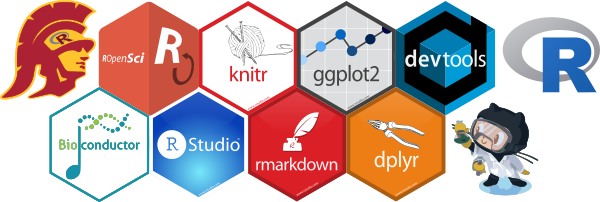

# R Bootcamp 

A snapshot of previous versins can be found at:

- [Fall 2020](https://github.com/USCbiostats/rbootcamp/tree/fall2020)
 (recorded sessions available on YouTube [here](https://www.youtube.com/playlist?list=PLnKhSzUbsBIk_OqfCWx6d2Olv0E9cxHSj)).

- [Fall 2019](https://github.com/USCbiostats/rbootcamp/tree/fall2019).

- [Fall 2018](https://github.com/USCbiostats/rbootcamp/tree/fall2018).

## Draft of the 2021 version (WIP)

- **Lecture 1** What is R? A motivating example of data viz 

- **Lecture 2** Data wrangling fundamentals

- **Lecture 3** Automatic docs with Rmarkdown

This year's presenters: [@erickawaguchi](https://github.com/erickawaguchi) and Sarah Piombo.

**Website**: https://github.com/USCbiostats/rbootcamp

This boot camp has as main goal to give a general overview of scientific
computing, and in particular, on the R programming language. It is
divided in 3 presentations. 

## Prerequisites

We will be using R and RStudio

1.  R: download [here](https://cran.r-project.org/).
2.  RStudio: download [here](https://www.rstudio.com/products/rstudio/download/#download).

# References

Wickham, H., and Grolemund, G. (2017) *R for Data Science: Visualize, Model, Transform, Tidy, and Import Data*. O'Reilly Media. ([free online](http://r4ds.had.co.nz/))

Wickham, H. (2019) *Advanced R*, 2nd Edition. CRC Press. ([free online](https://adv-r.hadley.nz/))

Peng, R. (2016) *R Programming for Data Science* ([free online](https://bookdown.org/rdpeng/rprogdatascience))

[Rstudio cheatsheets](https://www.rstudio.com/resources/cheatsheets/)

----

