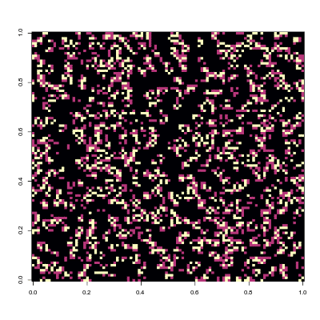

# Simulate "Conway's Game of Life"

## Description

Directly from [wikipedia](https://en.wikipedia.org/wiki/Conway%27s_Game_of_Life)

> The universe of the Game of Life is an infinite, two-dimensional orthogonal grid of square cells, each of which is in one of two possible states, alive or dead, (or populated and unpopulated, respectively). Every cell interacts with its eight neighbours, which are the cells that are horizontally, vertically, or diagonally adjacent. At each step in time, the following transitions occur:
> 
> 1. Any live cell with fewer than two live neighbors dies, as if by under population.
> 2. Any live cell with two or three live neighbors lives on to the next generation.
> 3. Any live cell with more than three live neighbors dies, as if by overpopulation.
> 4. Any dead cell with exactly three live neighbors becomes a live cell, as if by reproduction.

## Things to consider

1.  *The grid is infinite*, so, in the case of edge cells, to calculate the number of active neighbors, you'll need to consider the opposite side of it.

2.  You can either use the [magick](https://cran.r-project.org/package=magick), or the [animation](https://cran.r-project.org/package=animation) R packages to create a GIF animation of your work.

3.  Try using matrix algebra to compute the number of active neighbours, otherwise the problem can become very hard to compute (in terms of speed).

To motivate, here you'll find a couple of examples that I was able to build for this:

