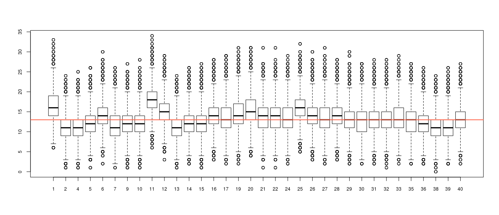
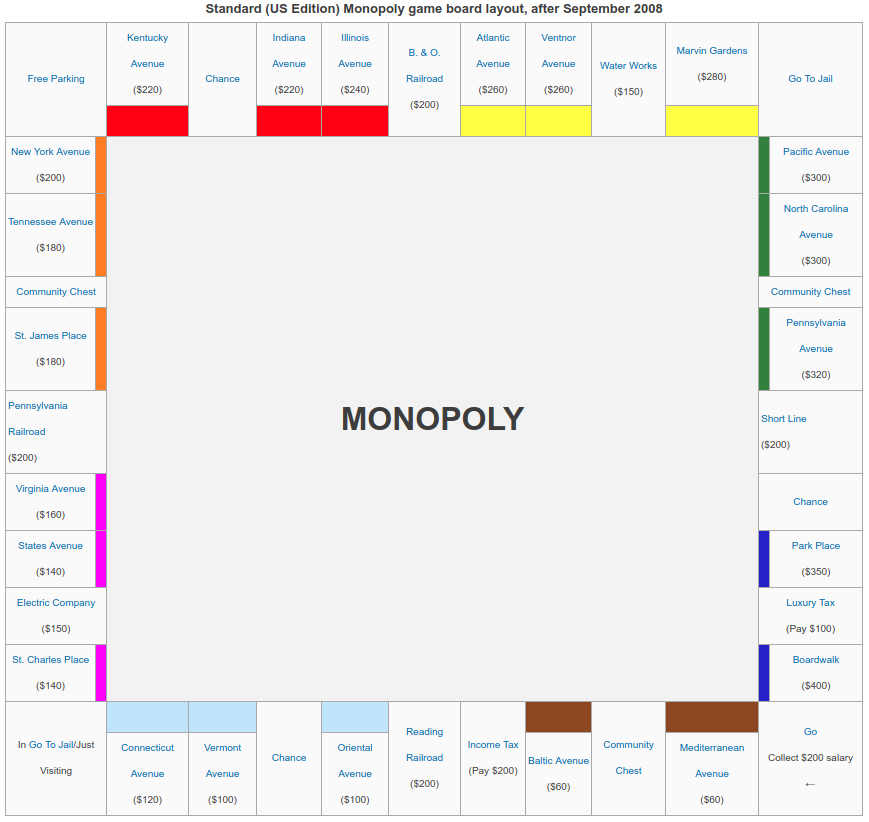

# Objectives

What should be the best strategy to play Monopoly (in terms of property
purchase)? A question that has keep be awake several nights. The idea is to create
a simulation function that provides a solution to this problem. To do so, you
need to consider the following:

1.  Users throw 2 six-sided-die at the same time to advance.

2.  There are 40 possible spots to fall on.

3.  When users fall in chance/community chest spots, there are some cards
    that may ask them to move around the board (that changes everything!).
    
4.  If the player hits double three times in a row, he goes imidiately to jail
    (more on die rules [here](http://monopoly.wikia.com/wiki/Die)).

To ease the simulation, assume that:

1.  There's only a single player (saad)

2.  Tthe player has infinite resources (in other words, don't mess with bankrupcy
    rules), and
    
3.  The game ends at the turn number 500.

If everything goes as expected, you should be getting something like the following
plot in which the distribution of the number of times an indivual steps into any
of the 40 locations of the board (excluding chance and community chest).

The simulation was carried out 50000, each time throwing the die 500 times.

To create the simulation, use the following description of the board and cards.

---------------------

# About Monopoly

## Board

## Community Chest ([source](http://monopoly.wikia.com/wiki/Community_Chest))

### Space Locations

* 1st Space: Between Mediterranean Avenue and Baltic Avenue.

* 2nd Space: Between St. James Place and Tennessee Avenue.

* 3rd Space: Between North Carolina Avenue and Pennsylvania Avenue.

### Cards

The text on each card in the current (as of Sept. 2008) U.S. Standard Edition (the "Atlantic City Edition") is as follows, Differences in one or more previous US editions appear in {scrolled brackets} (where actual texts were in various sizes of ALL CAPS, though this peculiarity is ignored below). Art in one or more of those editions is described in \<angle brackets\>. (Parentheses) are in the originals.

Difference in the UK standard edition should appear in [square brackets]

* Advance to Go (Collect $200) \<Mr. M strides in 7-league boots\>

* Bank error in your favor – Collect $200 \<Mr. M falls back in astonishment as an arm presents a sheaf of cash out of a bank teller's window\>

* Doctor's fees {fee} – Pay $50 \<Mr. M angrily brandishes crutches as he stomps with a leg cast\>

* From sale of stock you get $50 {$45} \<Mr. M, happily entangled in the tape of a stock ticker, waves cash (with no $ sign this time)\>

* Get Out of Jail Free {Get out of Jail, Free} – This card may be kept until needed or sold \<A winged Mr. M flutters out of a bird cage\>

* Go to Jail – Go directly to jail – Do not pass Go – Do not collect $200 \<A truncheon-wielding policeman in a light-colored uniform lifts a surprised Mr M by the collar\>

* Grand Opera Night {Opening} – Collect $50 from every player for opening night seats \<A wall sign near steps reads "Opera Tonite - 8 PM Sharp"; Mr. M leans against it checking his pocket watch in annoyance\>

* Holiday {Xmas} Fund matures - Receive {Collect} $100 \<Mr. M carries along a giant Xmas sock containing a sheaf of cash\>

* Income tax refund – Collect $20 \<Mr M faints back against a man displaying the Refund paper\>

* It is your birthday - Collect $10 from each player {Not in the deck}

* Life insurance matures – Collect $100 \<Below an I N S sign stands a bent Mr M, his long beard brushing the floor\>

* Pay hospital fees of $100 {Pay hospital $100} \<A bored nurse holds out her hand for payment while Mr. M holds 2 swaddled infants, one in each arm\>

* Pay school fees {tax} of $150 \<A bespectacled schoolboy unhappily receives a head pat and a dime ((Rockefeller style) from Mr. M.\>

* Receive $25 consultancy fee {Receive for services $25} \<As Justice of the Peace, a stern Mr. M holds out his hand for fee from an embarrassed groom whose bride hold a bouquet behind him\>

* You are assessed for street repairs – $40 per house – $115 per hotel \<Mr. M., supported by his near-ubiquitous cane in his left hand, holds a pick and shovel over his right shoulder\>

* You have won second prize in a beauty contest – Collect $10 \<Mr. M preens with a sash and large bouquet\>

* You inherit $100 \<Mr M. holds his head as unseen people's hands offer brochures titled "Buy Yacht", "World Tour", and "Rolls Royce"\>

## Chance ([source](http://monopoly.wikia.com/wiki/Chance))

### Space Locations

* 1st Space: Between Oriental Avenue and Vermont Avenue.

* 2nd Space: Between Kentucky Avenue and Indiana Avenue.

* 3rd Space: Between Short Line and Park Place.

### Cards

The text on each card in the current (as of Sept. 2008) U.S. Standard Edition (the "Atlantic City Edition") is as follows. Differences in one or more previous US editions appear in {scrolled brackets} (where actual texts were mostly in various sizes of ALL CAPS, and when in upper and lower case might be strangely capitalized--e.g., "pay owner Twice the Rental"--though none of these peculiarities is noted below). Art in one or more of those editions is described in \<angle brackets\>.

Differences in the UK standard edition should appear in [square brackets]. 

* Advance to Go (Collect $200) (Mr. M hops on both feet.)

* Advance to Illinois Ave. - If you pass Go, collect $200 {Second sentence omitted.} (Mr. M has tied a cloth bundle onto his cane to make a bindle, carried over his right shoulder, and is smoking a cigar)

* Advance to St. Charles Place – If you pass Go, collect $200 (Mr. M hurries along, hauling a little boy by the hand)

* Advance token to nearest Utility. If unowned, you may buy it from the Bank. If owned, throw dice and pay owner a total ten times the amount thrown. (Mr. M trudges along with a huge battleship token on his back)

* Advance token to the nearest Railroad and pay owner twice the rental to which he/she {he} is otherwise entitled. If Railroad is unowned, you may buy it from the Bank. (There are two of these.) (At lower left, Mr. M carries a large flatiron token with two hands; at upper right a railroad crossing is seen)

* Bank pays you dividend of $50 (With his feet up on a telephone-bearing desk, Mr. M leans back in an overstuffed chair, blowing cigar smoke rings)

* Get out of Jail Free – This card may be kept until needed, or traded/sold {This card may be kept until needed or sold - Get Out of Jail Free}{The first sentence is much smaller than the second} (Mr. M, in close-fitting one-piece prison stripes, is literally kicked out)

* Go Back 3 Spaces (Mr. M is hauled back by a cane hooked around his neck) {Presumably an allusion to amateur nights at theaters}

* Go to Jail – Go directly to Jail – Do not pass Go, do not collect $200 (A truncheon-carrying policeman in a dark-colored uniform hauls a surprised Mr M along by the feet)

* Make general repairs on all your property – For each house pay $25 – For each hotel $100 (Consulting a "How to Fix It" brochure, a hammer-wielding Mr. M sits astride a house not much larger than he is; it buckles under his weight)

* Pay poor tax of $15 (His trouser pockets pulled out to show them empty, Mr. M spreads his hands) (The video game version replaces this with Speeding fine $15, reportedly also in the UK version.)

* Take a trip to Reading Railroad {Take a ride on the Reading} – If you pass Go, collect $200 (Mr. M rides astride the TOOTing engine of a train)

* Take a walk on the Boardwalk – Advance token to Boardwalk. {Board Walk in both sentences} (Mr. M, a smallish dog hung over one arm, with the other pushes a squalling baby in a small pram; behind them, birds fly in the sky above a low fence)

* You have been elected Chairman of the Board – Pay each player $50 (A newsboy shouts an Extra with Mr. M's headshot on its front page)

* Your building {and} loan matures – Collect $150 {Up until the 1980s a "building and loan" was a financial institution.} (Mr. M joyfully embraces an apparent wife)

* You have won a crossword competition - Collect $100 {Not in the deck}