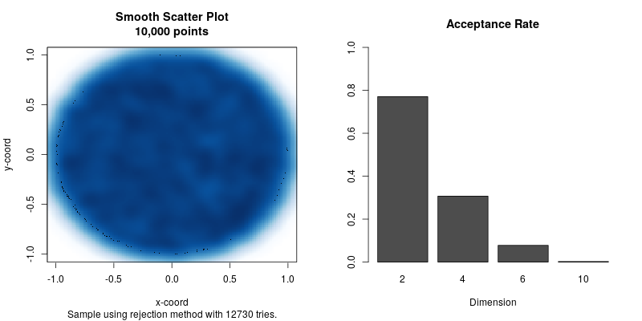

# Description

I enjoy studying statistics with simulations, and while going through one of
[PM520A's](https://web-app.usc.edu/ws/soc_archive/soc/term-20153/course/pm-522A/)
problem sets I encounter what I thought at first that was a trivial problem,
sampling points uniformly distributed within an n-dimensional ball.

While there are some smart solutions to solve this problem, I want you to approach
it using a brute force algorithm, rejection sampling.

The algorithm is as follows:

For i = 1 to n do:

1. Draw d points from a uniform(0,1), call it Y .
2. If the norm of Y is greater than 1, then repeat step 1.
3. Next i.

The following plot shows the result of a simple implementation of the algorithm
(not very computationally efficient)

The figure on the left shows the distribution of 10,000 points distributed
uniformly distributed in a d=2 ball, and the figure on the right shows the
acceptance rate for a single run trying to sample 1,000 from a 2, 4, 6, and 10
dimensional ball. As you can see, the acceptance rate decreases exponentially.

# Objectives

1.  Implement the rejection sampling method for obtaining uniformly distributed
    samples in the d-dimensional ball.
    