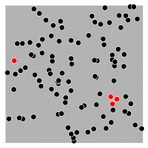

# Objectives

Simulate a contagion process with the following rules:

1.  There are 2 types of individuals, infected and not infected.
2.  Infected individuals move towards healthy individuals, and healthy
    individuals move away from infected ones.
3.  Give that a healthy individual is in contact with an infected one, the
    probability of becoming infected is fixed, e.g. 0.5, a coin toss.
4.  Individuals move at various speeds
5.  The direction towars which they move is a fixed point that corresponds to a
    weighted average, in particular, individual take the following point as a
    reference:
    ```
    p_fixed <- D[i, ]^(-1) %*% p / sum(D[i, ]^(-1))
    ```
    where `D[i, ]` is the vector of distances from `i` to its neighbours, and
    `p` is the matrix of coordinates `(x,y)` of `i`'s neighbours.
    
    

