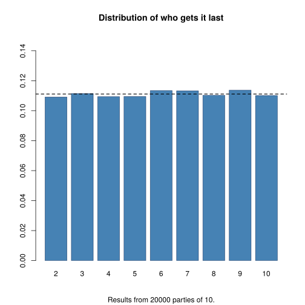

# The party game

You have been invited to a party in which the host is giving away a present.
Sited in round table, the host, you and 8 other guests pass the present
around to either of your neighbors depending on what a fair (or not) coin
tells the current gift holder:

*   Heads: Pass it to the left
*   Tails: Pass it to the right

The host, who seats in the first chair, holds the present first.
Whoever gets to get the present last wins the game and gets to keep it!

Since you are the host's best friend, he allows you to pick the chair first.
The question: What chair will you pick? The one to the left of the host,
the one to the right, or one that is the farthest away from him?

Write down a function to simulate the game, and plot the distribution of
the number of times that each one of the chairs 2 to 10 gets the present
last.

Can you show that the result looks something like this? (do you believe?)

