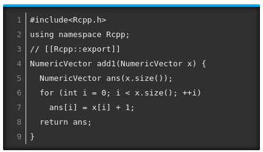

# Before we start

<div style="text-align: center; margin: auto;">
<a href="https://imgflip.com/i/38ji3q"></a>
<a href="https://imgflip.com/i/38jiku"></a>
</div>

1.  You need to have Rcpp installed in your system:
        
    ```r
    install.packages("Rcpp")
    ```
        
2.  You need to have a compiler
        
    -  Windows: You can download Rtools [from here](https://cran.r-project.org/bin/windows/Rtools/).
    
    -  MacOS: It is a bit complicated... Here are some options:
        
        *  CRAN's manual to get the clang, clang++, and gfortran compilers
        [here](https://cran.r-project.org/doc/manuals/r-release/R-admin.html#macOS).
        
        *  A great guide by the coatless professor
        [here](https://thecoatlessprofessor.com/programming/r-compiler-tools-for-rcpp-on-macos/)
            

And that's it!


# R is great, but...

*  The problem:
    
    *  As we saw, R is very fast... once vectorized
    
    *  What to do if your model cannot be vectorized?
    
*  The solution: **Use C/C++/Fotran! It works with R!**
    
*  The problem to the solution: **What R user knows any of those!?**
    

# R is great, but... (cont'd)

*  R has long time had an API (application programming interface) for integrating
   C/C++ code with R.
   
*  Unfortunately, it is not very straight forward

# Enter Rcpp

<div style="text-align: center; margin: auto;">

<br>

Dirk Eddelbuettel and Romain François, lead authors of this R package
</div>

From the package description:

>  The 'Rcpp' package provides R functions as well as C++ classes which offer a seamless integration of R and C++


# Why bother?

*   To draw 10 numbers from a normal distribution with sd = 100.0 using R C api:
    
    ```c
    SEXP stats = PROTECT(R_FindNamespace(mkString("stats")));
    SEXP rnorm = PROTECT(findVarInFrame(stats, install("rnorm")));
    SEXP call = PROTECT(
      LCONS( rnorm, CONS(ScalarInteger(10), CONS(ScalarReal(100.0),
      R_NilValue))));
    SET_TAG(CDDR(call),install("sd"));
    SEXP res = PROTECT(eval(call, R_GlobalEnv));
    UNPROTECT(4);
    return res;
    ```

-   Using Rcpp:
    
    ```c
    Environment stats("package:stats");
    Function rnorm = stats["rnorm"];
    return rnorm(10, Named("sd", 100.0));
    ```

# Example 1: Looping over a vector

```{Rcpp, cache=TRUE}
#include<Rcpp.h>
using namespace Rcpp;
// [[Rcpp::export]]
NumericVector add1(NumericVector x) {
  NumericVector ans(x.size());
  for (int i = 0; i < x.size(); ++i)
    ans[i] = x[i] + 1;
  return ans;
}
```

```{r}
add1(1:10)
```

# Example 1: Looping over a vector (vers 2)

Make it more sweet by adding some "sugar" (the Rcpp kind)

```{Rcpp, cache=TRUE}
#include<Rcpp.h>
using namespace Rcpp;
// [[Rcpp::export]]
NumericVector add1Cpp(NumericVector x) {
  return x + 1;
}
```

```{r}
add1Cpp(1:10)
```

# How much fast?

Compared to this:

```{r}
add1R <- function(x) {
  for (i in 1:length(x))
    x[i] <- x[i] + 1
  x
}

microbenchmark::microbenchmark(add1R(1:1000), add1Cpp(1:1000), unit = "relative")
```


# Main differences between R and C++

1.  One is compiled and the other interpreted

2.  Indexing objects: In C++ the indices range from 0 to `(n - 1)`, whereas in
    R is from 1 to `n`.
    
3.  All expressions end with a `;` (this is optional in R).

4.  In C++ object need to be declared, in R not ([dynamic](https://en.wikipedia.org/wiki/Dynamic_programming_language)).


# C++/Rcpp fundamentals: Types

Besides of the C-like types (`double`, `int`, `char`, and `bool`), we can use
the following types of objects with Rcpp:

- Matrices: `NumericMatrix`, `IntegerMatrix`, `LogicalMatrix`, `CharacterMatrix`

- Vectors: `NumericVector`, `IntegerVector`, `LogicalVector`, `CharacterVector`

- And more!: `DataFrame`, `List`, `Function`, `Environment`


# C++/Rcpp fundamentals: Parts of "an Rcpp program"

{style="width:500px;"}

```{r echo=FALSE}
bold_code <- function(x) {
  sprintf('<text style="color:white;font-weight:bold;font-family:monospace;background-color: black;border-style: solid;border-color: black;">%s</text>', x)
}
```


Line by line, we see the following:

1.  The `r bold_code("#include<Rcpp.h>")` is similar to `library(...)` in R, it brings in all that
    we need to write C++ code for Rcpp.
   
2.  `r bold_code("using namespace Rcpp")` is somewhat similar to `detach(...)`. This
    simplifies syntax. If we don't include this, all calls to Rcpp members need to be
    explicit, e.g. instead of typing `NumericVector`, we would need to type
    `Rcpp::NumericVector`
   
3.  The `//` starts a comment in C++, in this case, `r bold_code("// [[Rcpp::export]]")`
    comment is a flag that Rcpp uses to "export" this C++ function to R.
    
4.  Is the first part of the function definition. We are creating a function that
    returns a `r bold_code("NumericVector")`, is called `r bold_code("add1")`,
    has a single input element named  `r bold_code("x")` that is also a
    `r bold_code("NumericVector")`.

# C++/Rcpp fundamentals: Parts of "an Rcpp program" (cont'd)

{style="width:500px;"}

5.  Here we are declaring an object called `r bold_code("ans")` which is a
    `r bold_code("NumericVector")` with initial size equal to the size of
    `r bold_code("x")`. Notice that `r bold_code(".size()")` is called a
    "member function" of the `x` object, which is of class `NumericVector`.
    
6.  We are declaring a for-loop. This has three parts:
    
    a.  `r bold_code("int i = 0")` We declare the variable `i`, an integer, and initialize it at 0.
    
    b.  `r bold_code("i < x.size()")` This loop will end when `i`'s value is at or above the length of `x`.
    
    c.  `r bold_code("++i")` At each iteration, `i` will increment in one unit.

7.  `r bold_code("ans[i] = x[i] + 1")` set the i-th element of `ans` equal to
    the i-th element of `x` plus 1.
    
8.  `r bold_code("return ans")` exists the function returning the vector `ans`.


# C++/Rcpp fundamentals (cont'd 2)

Now, where to execute/run this?

> -   You can use the `sourceCpp` function from the `Rcpp` package to run .cpp 
    scripts (this is what I do most of the time).
    
> -   There's also the `cppFunction` that allows you especifying a function.

> -   Write an R package that works with Rcpp.

For now, let's just use the first option.


# Example running .cpp file

Imagine that we have the following file named `norm.cpp`

```{Rcpp simple-file, cahe=TRUE}
#include <Rcpp.h>

using namespace Rcpp;

// [[Rcpp::export]]
double normRcpp(NumericVector x) {
  
  return sqrt(sum(pow(x, 2.0)));
  
}
```

We can compile and obtain this function using this line `Rcpp::sourceCpp("norm.cpp")`.
Once compiled, a function called `normRcpp` will be available in the current
R session.

---

<div style="text-align:center;margin:auto;">
Now, get ready for some Rcpp action!


</div>


# Problem 1: Adding vectors

> 1.  Using what you have just learned about Rcpp, write a function to add two
    vectors of the same length. Use the following template
        
    ```cpp
    #include <Rcpp.h>
    
    using namespace Rcpp;
    
    // [[Rcpp::export]]
    NumericVector add_vectors([declare vector 1], [declare vector 2]) {
      
      ... magick ...
      
      return [something];
    }
    ```
        
    
> 2.  Now, we have to check for lengths. Use the `stop` function to see how can
    you return with an error if the two vectors don't match size. Add the
    following lines in your code
        
    ```cpp
    if ([some condition])
      stop("an arbitrary error message :)");
    ```

# Problem 2: Fibonacci series


> *   Each element of the sequence is determined by the following:
    
    $$
    F(n) = \left\{\begin{array}{ll}
    n, & \mbox{ if }n \leq 1\\
    F(n - 1) + F(n - 2), & \mbox{otherwise}
    \end{array}\right.
    $$

> *   Using recursions, we can implement this algorith in R as follows:
    
    ```{r}
    fibR <- function(n) {
      if (n <= 1)
        return(n)
      fibR(n - 1) + fibR(n - 2)
    }
    
    # Is it working?
    c(fibR(0), fibR(1), fibR(2), fibR(3), fibR(4), fibR(5), fibR(6))
    ```

Now, let's translate this code into Rcpp and see how much speed boost we get!

# Problem 2: Fibonacci series (solution)

```{Rcpp fib, cache=TRUE}
#include <Rcpp.h>

// [[Rcpp::export]]
int fibCpp(int n) {
  if (n <= 1)
    return n;
  
  return fibCpp(n - 1) + fibCpp(n - 2);
  
}
```

```{r}
microbenchmark::microbenchmark(
  fibR(20),
  fibCpp(20), unit="relative"
)
```

# Thank you!

<div align="center">
R Bootcamp day 3<br>Statistical Computing Track<br><br>
</div>


<div align="center" style="font-size:40px;">
**website**: [ggvy.cl](https://ggvy.cl)<br><br>
**twitter**: [\@gvegayon](https://twitter.com/gvegayon)<br><br>
**github**: [gvegayon](https://github.com/gvegayon)<br><br>
</div>


# Session info

```{r}
devtools::session_info()
```

